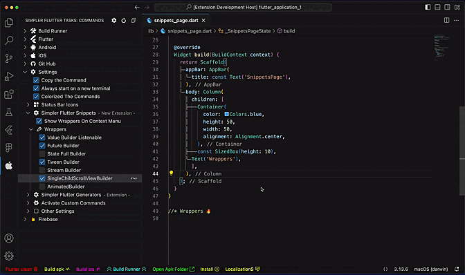

# simpler-flutter-snippets README
<div align="center">
  <a href="https://marketplace.visualstudio.com/items?itemName=Eldiyar-Dev.simpler-flutter-tasks">
    
  </a>

</div>

<h1>Snippets for Flutter </h1>


<h1>Wrappers for Flutter </h1>


A set of helpful Flutter and Dart Snippets for day to day Flutter development.

## Installation

- Name of Package - Simpler Flutter Snippets -
- [Visual Studio Code | Visual Studio Marketplace](https://marketplace.visualstudio.com/items?itemName=Eldiyar-Dev.simpler-flutter-snippets) 


## Features

Simply Flutter / Dart Snippets

I'm working hard to select all the day to day widgets, so wait for more Snippets!.

### Flutter / Dart related Snippets

### Flutter related snippets

| Snippet Widgets       |Description                                                                 |
| ----------------------|-----------------------------------------------------------------------     |
| `stateFullWidget -->` |  StatefulWidget()                                                          |
| `stateLessWidget -->` |  StatelessWidget()                                                         |
| `caaaaaa -->`         |  crossAxisAlignment: CrossAxisAlignment.[choice](),                        |
| `maaaaaa -->`         |  mainAxisAlignment: MainAxisAlignment.[choice](),                          |
| `mainAxi -->`         |  mainAxisSize: MainAxisSize.min                                            |
| `ftxt -->`            |  Text()                                                                    |
| `frxr -->`            |  Text.rich()                                                                    |
| `fstyle -->`          |  TextStyle()                                                               |
| `1xHeight -->`        |  const SizedBox(height: [action]()),                                       |
| `1xWidth -->`         |  const SizedBox(width: [action]()),                                        |
| `1xx -->`             |  const SizedBox(width: 10,  height: 10,),                                  |
| `SizedBox -->`        |  const SizedBox.[choice]()                                                 |
| `fic -->`             |  const Icon(Icons.clear);                                                  |
| `ficbtn -->`          |  const IconButton()                                                        |
| `fcontainer -->`      |  Container()                                                               |
| `fsaffold -->`        |  Scaffold()                                                                |
| `listViewB -->`       |  ListView.builder()                                                        |
| `listViewS -->`       |  ListView.separated()                                                      |
| `gridViewB -->`       |  GridView.builder()                                                        |
| `gridViewC -->`       |  GridView.count()                                                          |
| `pageViewB -->`       |  PageView.builder()                                                        |
| `padding --> `        |  [choice](): const EdgeInsets.all(10),                                     |
| `fedgeAll -->`        |  EdgeInsets.all(32.0)                                                      |
| `fedgeOnly -->`       |  const EdgeInsets.only()                                                   |
| `fedgSym -->`         |  const EdgeInsets.symmetric(vertical: 8, horizontal: 8,),                  |
| `felebtn -->`         |  ElevatedButton()                                                          |
| `fimg -->`            |  Image.[choice|assets,network|];                                           |
| `borderCircular -->`  |  borderRadius: BorderRadius.circular([action]()),                          |
| `borderAll -->`       |  borderRadius: BorderRadius.all(Radius.circular([action]())),              |
| `fshowDialog -->`     |  showDialog()                                                              |
| `frow -->`            |  Row       
| `fcol -->`            |  Column         
| `flist -->`           |  List<String> listName = [];
| `fcolorHax -->`       |  Color(0xFF9C27B0),   
| `fvalueNotifier -->`  |  ValueNotifier customValue = ValueNotifier<bool>(false);
| `fanimatedBuilder -->`|  late Animation<double> animations;            
| `fvariable -->`       |  Just Variables  
| `fmap -->`            |  Map<dynamic, dynamic> mapName = {};
| `fset -->`            |  Set<dynamic> setName = {};
| `fgetarr -->`         |  dynamic get name => returnValue;
| `fsettarr -->`        |  set name(dynamic value) => some = value; 
| `ff -->`                         

### Flutter Life Cycle related snippets


| Snippet Cycles        |Description                                                                 |
| ----------------------|-----------------------------------------------------------------------     |
| `flifeInit -->`        |  InitState()                                                               |
| `flifeDispose -->`     |  Dispose()                                                                 |
| `flifeReassemble -->`  |  Reassemble()                                                              |
| `flifeDidChangeD -->`  |  DidChangeD()                                                              |
| `flifeDidUpdateW -->`  |  DidUpdateW()                                                              |
| `flifeDiActivate -->`  |  DiActivate()                                                              |
| `flifeCycle -->`       |  Cycle()                                                                   |


### Flutter Dop related snippets

| Snippet Widgets               |Description                                                         |
| ------------------------------|--------------------------------------------------------------      |
| `fnav material -->`           |  Navigator.push() material                                         |
| `fnav cupertino -->`          |  Navigator.push() cupertino                                        |
| `mateApp -->`                 |  MaterialApp()                                                     |
| `cupeApp -->`                 |  CupertinoApp()                                                    |
| `fsvg -->`                    |  SvgPicture.asset()                                                |
| `flocale -->`                 |  LocaleKeys..tr(),()                                               |
| `dddddddddddddddddLog --->`   |  log('data: [choice]()')                                           |
| `usecase -->`                 |  usecases()                                                        |
| `fcontroller -->`             |  controller()                                                      |
| `context --> read`            |  context.read<>().add();                                           |
| `context --> router`          |  context.router.push();                                            |
| `fgetttttt -->`                |  GetIt.I<>()..add()                                                |
| `toStr -->`                   |  toString()                                                        |
| `fSimplerFlutterReCase -->`   |  just cases()                                                      |
| `futureFunc -->`              |  Future<void>                                                      |
| `freezed -->`                 |  freezed model                                                     |
| `fhiveModel -->`              |  hive model                                                        |

deleted in version 0.1.9
| `trrrrr Repo -->`             |  try - repo()                                                      |
| `trrrrr Simple -->`           |  try - simple()                                                    |
| `trrrrr Pro -->`              |  try - dop()                                                       |
| `repo -->`                    |  repository()                                                      |
| `into -->`                    |  interactor()                                                      |

### Flutter related Wrapper

| Wrappers Widgets              |   Description                   |        visibility on Menu        |
| ------------------------------|---------------------------------|----------------------------------|
|`Wrap with Value Listenable`   |  ValueListenableBuilder         |       [default] -  true          |
|`Wrap with Cubit/Bloc Builder` |  Cubit/Bloc Builder             |       [default] -  false         |
|`Wrap with Cubit/Bloc Consumer`|  Cubit/Bloc Consumer            |       [default] -  false         |
|`Wrap with Stack Widget`       |  Stack                          |       [default] -  true          |
|`Wrap with Future Builder`     |  FutureBuilder                  |       [default] -  false         |
|`Wrap with StateFullBuilder`   |  StateFullBuilder               |       [default] -  false         |
|`Wrap with Tween Builder`      |  Tween Builder                  |       [default] -  false         |
|`Wrap with AnimatedBuilder`    |  AnimatedBuilder                |       [default] -  false         |
|`Wrap with StreamBuilder`      |  StreamBuilder                  |       [default] -  false         |
|`Wrap with SingleChildScroll`  |  SingleChildScrollViewBuilder   |       [default] -  false         |
|`Wrap with Expanded`           |  Expanded                       |       [default] -  false         |
|`Wrap with Flexible`           |  Flexible                       |       [default] -  false         |
|`Wrap with FittedBox`          |  FittedBox                      |       [default] -  false         |


### Flutter related Imports

| Imports                          |   Description                                                |
| ---------------------------------|--------------------------------------------------------------|
|`fimport --> MaterialApp`         |  import Material App                                         |                        
|`fimport --> CupertinoApp`        |  import Cupertino App                                        |                          
|`fimport --> Provider`            |  import Provider                                             |                                       
|`fimport --> Locale`              |  import Locale                                               |
|`fimport --> autRoute g`          |  import autRoute g                                           |        
|`fimport --> flutter bloc`        |  import flutter bloc                                         |        
|`fimport --> equatable`           |  import equatable                                            |      
|`fimport --> injectable`          |  import injectable                                           |  
| ---------------------------------|--------------------------------------------------------------|      
### Flutter just logger

| Logger Type                      |   Description                                                |
| ---------------------------------|--------------------------------------------------------------|
|`from Clipboard Logger`           |  log(data-unique: ${ from clipboard } )                      |                        
|`only Interpolation Logger`       |  log(data-unique: ${  } ) - with only interpolation          |                          
|`simple Logger`                   |  log(data:) - simple                                         |


`Wrappers`
```json
"SimplerFlutterSnippets.WrapperOnMenu": "show",
"SimplerFlutterSnippets.FutureBuilder": true,
"SimplerFlutterSnippets.ValueListenableBuilder": true,
"SimplerFlutterSnippets.StateFullBuilder": true,
"SimplerFlutterSnippets.TweenBuilder": true,
"SimplerFlutterSnippets.StreamBuilder": true,
"SimplerFlutterSnippets.SingleChildScrollViewBuilder": true,
"SimplerFlutterSnippets.AnimatedBuilder": true,
"SimplerFlutterSnippets.CubitBuilder": true,
"SimplerFlutterSnippets.CubitConsumer": true,
"SimplerFlutterSnippets.WrapperStack": true,
"SimplerFlutterSnippets.removeThisWidget": true,
"SimplerFlutterSnippets.TypeLogger": "from Clipboard Logger" 
```
`SimplerFlutterSnippets.TypeLogger `
 - working only on keyShorts snippets.customLogger


## Release Notes
### 0.2.0-0.2.3 (Fixing bugs)
  - little release 
    - added keybinding remove this widget 
      - mac cmd+shift+r
      - winda ctrl+shift+r
### 0.1.9
  - added new Wrappers with auto imports
    - Stack
    - Cubit/Bloc Builder
    - Cubit/Bloc Consumer
  - to snippet "listViewS" add default SIzedBox
### 0.1.8
  - fixed increment the logger
  
### 0.1.7
  - frxr -> Text.rich()
  - wrapeers command + shift + e -> 
    - expanded, 
    - flexible,
    - fittedBox
  - wrapper command + shift + s 
    - SingleChildScrollView
    - Padding  
  - fhiveModel - hive Model
  - fnav cupertino - Navigator - Cupertino
  - changed Log'a String to data-unique

### 0.1.5
  - Changed Log's String -> data to <CopyClipBoard>

### 0.1.4
  - Bug Fixed 
  - Optimized The Extension

### 0.1.3
  - ReWrite Settings
### 0.1.0
  - added logger
    - snippets.customLogger add keybinding

### 0.0.8
  - Wrappers
    - StateFullBuilder
    - AnimatedBuilder
    - StreamBuilder
    - SingleChildScrollViewBuilder

  - Snippets
    - fvalueNotifier
    - freezed
    - frow
    - fcol
    - flist
    - fcolorHax
    - fvalueNotifier
    - fanimatedBuilder
    - fvariable
    - fmap
    - fset
    - fgetarr
    - fsettarr
    - ff
### 0.0.7
  - Tween Builder
  
  - hide / show 
    - on vs code menu
    
### 0.0.3-4-6
  - wrappers
    - ValueListableBuilder
    - FutureBuilder
### 0.0.2
  - Widgets
  - Life Cycle
  - Dop
### 0.0.1

Initial release

**Enjoy!**
